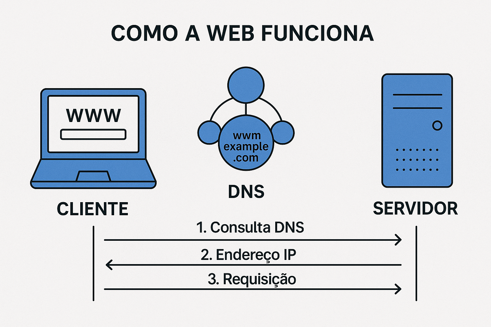

# Programação Web :mortar_board:

*Introdução*

---

## O que é a Internet? 

- Uma rede gigante de computadores interconectados globalmente.
- Permite a **troca de informações** e a **comunicação** entre bilhões de dispositivos.
- É a base para a **Web** (World Wide Web), mas não é a mesma coisa!

---

## O que é a Web (World Wide Web)?

- Um dos **serviços** da Internet (como e-mail, streaming de vídeo, etc.).
- Sistema de **documentos interligados** (páginas web) e outros recursos acessíveis via navegadores.
- Baseado em HTML (linguagem), HTTP (protocolo) e URLs (endereços).

---

## Qual a origem da Web (World Wide Web)?

- `Quem?` Sir **Tim Berners-Lee** (cientista britânico).
- `Onde?` **CERN** (Organização Europeia para a Pesquisa Nuclear), na Suíça.
- `Quando?` Proposta em 1989, lançada publicamente em 1991.
- `Por quê?` Facilitar o compartilhamento de informações entre cientistas.

---

## Qual a origem da Web (World Wide Web)?

- Primeiro servidor web: https://info.cern.ch/

---

## Como a Web Funciona?

- **Clientes** são os típicos dispositivos conectados à internet utilizando seus navegadores.

- **Servidores** são computadores que armazenam páginas, sites ou aplicativos. Quando o dispositivo de um cliente quer acessar uma página, uma cópia dela é baixada do servidor para a máquina do cliente para ser apresentada no navegador web do usuário.

---

---

## Como a Web Funciona?

- **Conexão de Internet**: permite que você mande e receba dados na web.
- **TCP/IP**: Protocolo de Controle de Transmissão e Protocolo de Internet (Transmission Control Protocol e Internet Protocol) são protocolos de comunicação que definem como os dados trafegam pela web. 
- **DNS**: Servidor de Nome de Domínio (Domain Name Servers) são como um catálogo de endereços para sites.

---

## Como a Web Funciona?

- **HTTP**: Protocolo de Transferência de Hypertexto (Hypertext Transfer Protocol) é um protocolo de aplicação que define uma linguagem para clientes e servidores se comunicarem entre si. 
- **Arquivos e resursos**: os sites são feitos principalmente de HTML, CSS e JavaScript, além das imagens, música, vídeos, documentos do Word e PDFs.

---

# Programação Web :mortar_board:

*Ferramentas*

---

## DevTools

- [https://developer.chrome.com/docs/devtools?hl=pt-br](https://developer.chrome.com/docs/devtools?hl=pt-br)

---

## DevTools

- Elementos
- Console
- Fontes
- Rede

---

## DevTools

- Desempenho
- Memória
- Aplication
- Privacidade e segurança
- Lighthouse

---

## IDE

- Qualquer uma :smile: ...VSCode

---

# Programação Web :mortar_board:

*Considerações sobre o desenvolvimento de aplicações Web*

---

## Arquitetura e Design da Aplicação

- **Microsserviços**: Dividir a aplicação em serviços menores e independentes para facilitar o desenvolvimento, deploy e escalonamento de partes específicas.

- **Comunicação Assíncrona**: Usar filas de mensagens (**Kafka** e **RabbitMQ**) para tarefas demoradas, evitando bloquear a requisição principal.

- **APIs Bem Definidas**: Usar padrões como **RESTful**, **GraphQL** ou **gRPC**, com versionamento claro, paginação, filtragem e ordenação para otimizar o uso de dados.

---

## Arquitetura Stateless

- Evitar armazenar estado de sessão no servidor. Isso permite que qualquer servidor processe qualquer requisição, facilitando o balanceamento de carga e a escalabilidade horizontal.

---

## Banco de Dados

- **Tipo**: Relacionais (SQL) vs. Não Relacionais (NoSQL - MongoDB, Cassandra, Redis) – escolher com base no tipo de dado e padrões de acesso.

- **Replicação**: Para distribuir leituras e garantir alta disponibilidade.

- **Sharding/Particionamento**: Dividir o banco de dados em partes menores para distribuir a carga.

---

## Geração de Conteúdo

- **Server-Side Rendering (SSR)**: Renderizar HTML no servidor para a primeira carga, melhorando SEO e performance inicial.

- **Static Site Generation (SSG)**: Gerar páginas HTML estáticas em tempo de build para conteúdo que muda pouco, resultando em performance e segurança máximas via CDN.

- **Client-Side Rendering (CSR)**: Usar JavaScript para renderizar o conteúdo no navegador para aplicações altamente interativas.

---

## Otimização de Performance

- **Cache no Cliente (Browser Cache)**: Utilizar cabeçalhos HTTP (`Cache-Control`, `ETag`, `Last-Modified`) para que o navegador armazene recursos estáticos.

- **Cache no Servidor**: Implementar caching em memória (Redis, Memcached) para dados frequentemente acessados e resultados de consultas pesadas.

- **CDN (Content Delivery Network)**: Distribuir ativos estáticos (imagens, CSS, JS) globalmente para servi-los a partir do local mais próximo do usuário.

---

## Otimização de Código e Recursos

- **Minificação e Compressão**: Reduzir o tamanho de arquivos HTML, CSS, JavaScript (usar Gzip/Brotli).

- **Otimização de Imagens**: Comprimir, redimensionar para tamanhos apropriados, usar formatos modernos (WebP, AVIF) e lazy loading (carregar imagens apenas quando visíveis).

- **Assincronicidade**: Usar operações assíncronas (async/await, promises) para evitar bloqueio de threads em I/O.

---

## Otimização de Código e Recursos

- **Refatoração e Algoritmos Eficientes**: Otimizar algoritmos e estruturas de dados no código-fonte.

- **Reduzir Requisições**: Combinar arquivos CSS e JS, usar sprites de imagem.

- **Keep-Alive**: Manter conexões HTTP persistentes para reutilizar a mesma conexão TCP.

---

## Escalabilidade da Infraestrutura

- **Balanceamento de Carga (Load Balancing)**: Distribuir o tráfego de requisições entre múltiplos servidores de aplicação para evitar sobrecarga em um único ponto.

- **Auto Scaling**: Configurar a infraestrutura para adicionar ou remover automaticamente servidores de aplicação (e, se possível, de banco de dados) com base na demanda (uso de CPU, tráfego de rede).

- **Conteinerização (Docker) e Orquestração (Kubernetes)**: Permitem empacotar a aplicação e suas dependências, facilitando o deploy consistente e o escalonamento horizontal em ambientes de nuvem.

---

## Escalabilidade da Infraestrutura

- **Infraestrutura como Código (IaC)**: Usar ferramentas como Terraform, Ansible, CloudFormation para gerenciar e provisionar a infraestrutura de forma automatizada e replicável.

- **Serverless (FaaS)**: Para funcionalidades específicas que podem ser executadas como funções, escalando automaticamente e pagando apenas pelo uso.

---

## Monitoramento e Testes

- **Monitoramento Contínuo**: Monitorar métricas de desempenho (CPU, memória, latência, throughput, erros, conexões de DB) em tempo real usando ferramentas como Prometheus, Grafana, New Relic, Datadog.

- **Configuração de alertas**: Configurar alertas para detectar problemas proativamente.

- **Logging Centralizado**: Coletar logs de todos os componentes da aplicação em um local centralizado (ELK Stack, Splunk) para facilitar a depuração e análise de problemas.

---

## Monitoramento e Testes

- **Testes de Carga e Estresse**: Simular alto volume de tráfego para identificar gargalos e verificar como a aplicação se comporta sob pressão antes de ir para produção.

- **Testes de Performance**: Testar o tempo de carregamento de páginas, tempo de resposta de APIs etc., para garantir que as otimizações estão funcionando.

---

## Segurança

- **HTTPS**: Criptografia de ponta a ponta para toda comunicação.

- **Autenticação e Autorização Fortes**: Uso de padrões como OAuth 2.0, JW; MFA (Multi-Factor Authentication); Princípio do menor privilégio (dar apenas as permissões necessárias).

- **Validação de Entrada de Dados**: Prevenir ataques de injeção (SQL Injection, XSS) sanitizando e validando todas as entradas do usuário.

- **Rate Limiting**: Limitar o número de requisições por IP/usuário para prevenir ataques de força bruta e DoS.

---

## Segurança

- **Gerenciamento de Segredos**: Armazenar chaves de API, senhas e outras informações sensíveis de forma segura (cofres de segredos).

- **Web Application Firewall (WAF)**: Proteger a aplicação contra ameaças comuns da web.

- **Atualizações Regulares**: Manter todas as bibliotecas, frameworks e sistemas operacionais atualizados para corrigir vulnerabilidades conhecidas.

---

## DevOps

- **CI/CD (Integração Contínua / Entrega Contínua)**: Automatizar os processos de build, teste e deploy para garantir entregas rápidas, consistentes e com menos erros.

- **Versionamento de Código**: Usar Git e plataformas como GitHub/GitLab/Bitbucket.

- **Revisão de Código**: Garantir a qualidade do código e identificar potenciais problemas de performance/segurança cedo.

---

# Programação Web :mortar_board:

*Referências*

---

## Referências 

- https://developer.mozilla.org/pt-BR/docs/Learn_web_development/Getting_started/Web_standards/How_the_web_works

---

# Obrigado :metal:

---

## Eduardo Cruz Araujo

- E-mail: [eduardo.araujo28@fatec.sp.gov.br](eduardo.araujo28@fatec.sp.gov.br)
- Instagram: [edcaraujo](https://www.linkedin.com/in/edcaraujo/)
- Linkedin: [edcaraujo](https://www.instagram.com/)
- Github: [edcaraujo](https://github.com/edcaraujo)